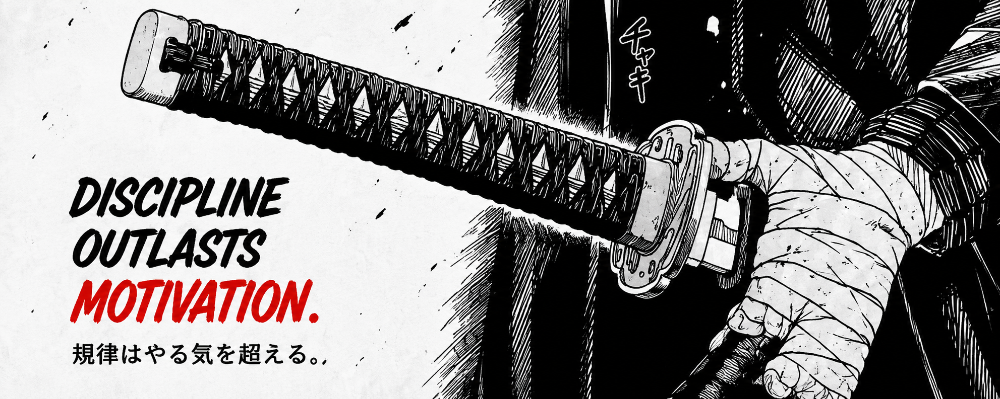

 

# Hi, I'm <strong>Vaibhav</strong> 👋

### MERN Stack Developer

Engineering digital experiences with purpose.

 

<table width="100%">
<tr>

<td valign="top" width="70%">

# ABOUT

Hi, I'm **Vaibhav**.

I build modern web applications
that balance **clean architecture**,
**thoughtful design**,
and **real-world usability**.

Every project I create is another step
towards mastering product engineering.

</td>

<td valign="top" width="30%">

# INFO

📍 India

⚡ MERN Stack Developer

🤝 Open to Collaborate

📚 Always Learning

</td>

</tr>
</table>

 

# TECH STACK

&nbsp;&nbsp;&nbsp;

&nbsp;&nbsp;&nbsp;

&nbsp;&nbsp;&nbsp;

&nbsp;&nbsp;&nbsp;

  

&nbsp;&nbsp;&nbsp;

&nbsp;&nbsp;&nbsp;

&nbsp;&nbsp;&nbsp;

&nbsp;&nbsp;&nbsp;

 

---

# PROJECT SHOWCASE

<table width="100%">

<tr>

<td width="50%" valign="top">

### 🌿 Flora

A modern productivity ecosystem designed to help students and professionals stay organized with weather, tasks, notes, planner and focus tools.

**Tech Stack**

`HTML` `CSS` `JavaScript`

 

<a href="YOUR_FLORA_LIVE_LINK">🌐 Live Demo</a> • <a href="YOUR_FLORA_GITHUB_LINK">💻 Source Code</a>

</td>

<td width="50%" valign="top">

</td>

</tr>

</table>

 

<table width="100%">

<tr>

<td width="50%" valign="top">

</td>

<td width="50%" valign="top">

### 🌦 Weather Dashboard

A responsive weather application with dynamic backgrounds, real-time forecasts and a clean user experience.

**Tech Stack**

`HTML` `CSS` `JavaScript`

 

<a href="YOUR_WEATHER_LIVE_LINK">🌐 Live Demo</a> • <a href="YOUR_WEATHER_GITHUB_LINK">💻 Source Code</a>

</td>

</tr>

</table>

 

<table width="100%">

<tr>

<td width="50%" valign="top">

### 🛒 Amazon Clone

A pixel-perfect landing page inspired by Amazon with responsive layouts, reusable components and modern UI practices.

**Tech Stack**

`HTML` `CSS`

 

<a href="YOUR_AMAZON_LIVE_LINK">🌐 Live Demo</a> • <a href="YOUR_AMAZON_GITHUB_LINK">💻 Source Code</a>

</td>

<td width="50%" valign="top">

</td>

</tr>

</table>

 

<table width="100%">

<tr>

<td width="50%" valign="top">

</td>

<td width="50%" valign="top">

### 🍽 Restaurant Management System

A full-featured academic project focused on restaurant operations, order management and user-friendly workflows.

**Tech Stack**

`HTML` `CSS` `JavaScript`

 

<a href="YOUR_RMS_LIVE_LINK">🌐 Live Demo</a> • <a href="YOUR_RMS_GITHUB_LINK">💻 Source Code</a>

</td>

</tr>

</table>

 

---

# GITHUB ANALYTICS

---

# CONNECT

&nbsp;&nbsp;&nbsp;

&nbsp;&nbsp;&nbsp;

---

> ### **Discipline outlasts motivation.**

 

Thank you for visiting my profile.

⭐ If you like my work, consider following my journey.

